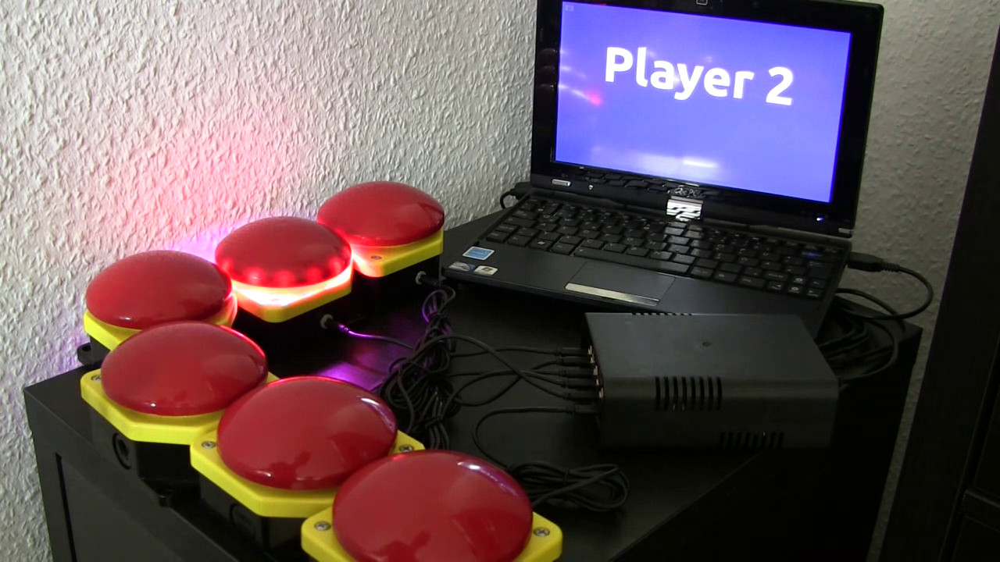
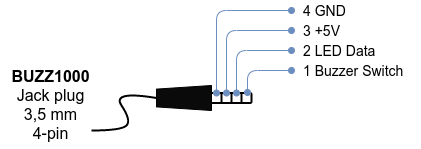

# BUZZ1000
**Arduino Controlled Buzzer System For Events**

The Buzz1000 is an Arduino-controlled buzzer system for events, e.g. Quizzes or other games in which it is necessary to determine which person pressed the button first. After a buzzer has been pressed, the other buzzers are blocked for 3 seconds - so the winner can be clearly determined.

When you press a buzzer, the controller sends a keystroke (digits 1 to 6) to the connected computer. This allows the computer to contribute to game atmosphere, e.g. by playing sound effects.

**[Launch the Buzzer Webapps](https://schorschii.github.io/buzz1000)**  
You can test the webapps by pressing the keys 1-6 on your keyboard. You can also play offline (please read the instructions on the start page).

- [Simple Buzzer Webapp](https://schorschii.github.io/buzz1000/webapp/buzzer-simple.html)  
  Shows player name and plays sound when key 1..6 is pressed
- [Buzzer Webapp With Bars](https://schorschii.github.io/buzz1000/webapp/buzzer-bars.html)  
  Plays sound when key 1..6 is pressed and displays the score of each player graphical with a vertical bar for comparison.
- [Buzzer Webapp With Timer](https://schorschii.github.io/buzz1000/webapp/buzzer-timer.html)  
  Starts a timer when any key is pressed, stops it and plays a sound when key 1..6 is pressed and displays the last stopwatch time.
- [Buzzer Webapp With Separate Timers](https://schorschii.github.io/buzz1000/webapp/buzzer-separate-timers.html)  
  Starts a timer for each player when any key is pressed, stops the individual timer and plays a sound when key 1..6 is pressed.

Each buzzer is equipped with 14 LEDs, which start to play different light effects when pressed. This makes it clear which player pressed his buzzer first.

## Hardware Documentation
The system's main components are:
- 1x Arduino MKR WiFi 1010
- 6x Giovenzana PG1M9W01 (Inexpensive Mushroom Head Push Buttom)
- WS2812B RGB LED Stripe (50 SMD LEDs per meter -> 14 LEDs inside each Buzzer Head)
- 3,5mm **4pin** Jack Connector/Cable between Arduino and Buzzer

Jack connector pinout:  

## Software Documentation
This is how you can update your buzzer controller.

0. Install the [Arduino IDE](https://www.arduino.cc/en/software) and connect your Arduino.
   - Menu: Tools -> Board -> Arduino MK WiFi 1010
   - Menu: Tools -> Port -> Select your connected Buzzer Arduino
1. Install the FastLED library.
   - Menu: Sketch -> Include Library -> Manage Libraries ... -> Search "FastLED" -> Click "Install" -> Close
2. Download this BUZZ1000 repo and open the file `arduino/buzzer/buzzer.ino` in the IDE.
3. Upload the software to the Arduino (Menu: Sketch -> Upload).
